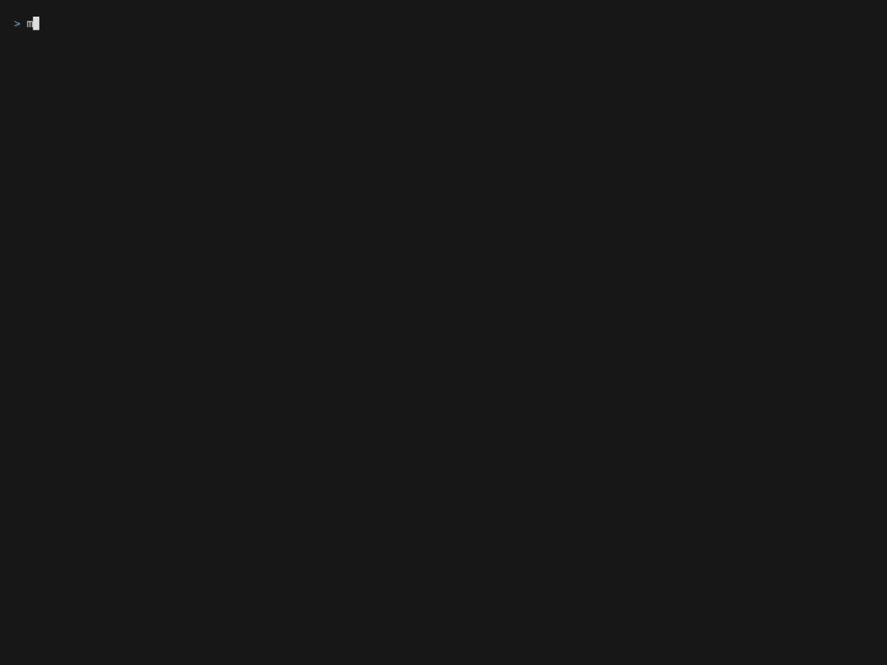

Mercator
--------



OpenStreetMap but as terminal user interface (TUI) program and [Bubble 
Tea](https://github.com/charmbracelet/bubbletea) Bubble.

## Build

```sh
$ go get
$ go build .
```

The binary is called `mercator`


## Usage

`mercator` accepts latitude and longitude as arguments, e.g.:

```sh
$ mercator 25.0782266 -77.3383438
```

It also accepts a location name or address, e.g.:

```sh
$ mercator miami
```

### Style

`mercator` accepts the `-style` flag with an integer value representing one of 
the options [listed as 
`Style`](https://github.com/mrusme/mercator/blob/master/mapview/mapview.go#L24), 
e.g.:

```sh
$ mercator -style 4 new york
```


### Navigation

- `arrow up`/`k`: Move north
- `arrow right`/`l`: Move east
- `arrow down`/`j`: Move south
- `arrow left`/`h`: Move west
- `-`/`_`: Zoom out
- `+`/`=`: Zoom in


## Bubble

You can embed the `mapview` into your Bubble Tea application:

```go
package main

import (
  tea "github.com/charmbracelet/bubbletea"
  "github.com/mrusme/mercator/mapview"
)

type model struct {
  mv mapview.Model
}

func main() {
  m := NewModel()
  m.mv.SetLocation("jamaica", 15)

  p := tea.NewProgram(m, tea.WithAltScreen())
  if _, err := p.Run(); err != nil {
    panic(err)
  }
}

func NewModel() model {
  m := model{}
  m.mv = mapview.New(80, 24)
  return m
}

func (m model) Init() tea.Cmd {
  return tea.Batch(tea.EnterAltScreen)
}

func (m model) Update(msg tea.Msg) (tea.Model, tea.Cmd) {
  switch mt := msg.(type) {
  case tea.KeyMsg:
    switch mt.String() {
    case "q", "esc", "ctrl+c":
      return m, tea.Quit
    }

  case tea.WindowSizeMsg:
    m.mv.Width = mt.Width
    m.mv.Height = mt.Height
    return m, nil

  }

  var cmd tea.Cmd
  m.mv, cmd = m.mv.Update(msg)
  return m, cmd
}

func (m model) View() string {
  return m.mv.View()
}
```
